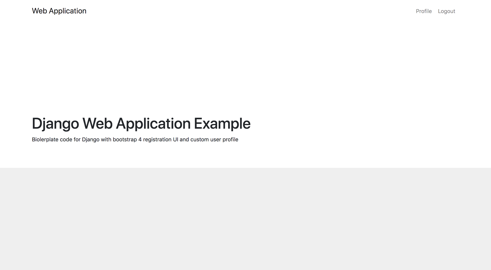
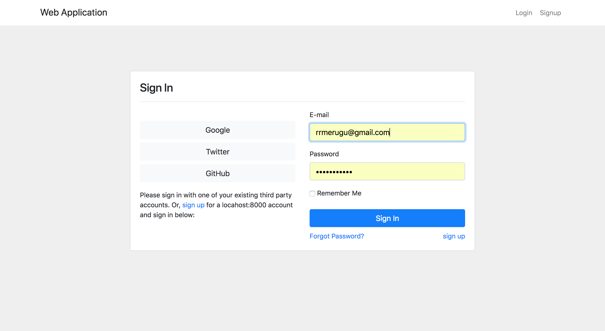
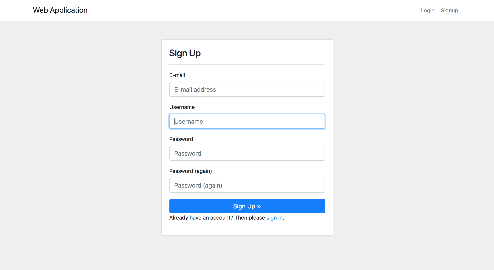
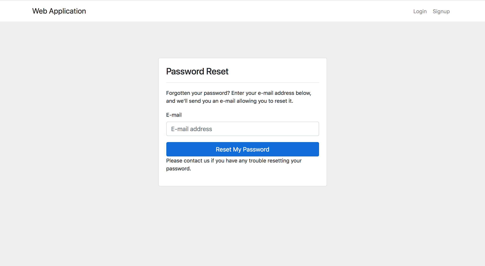
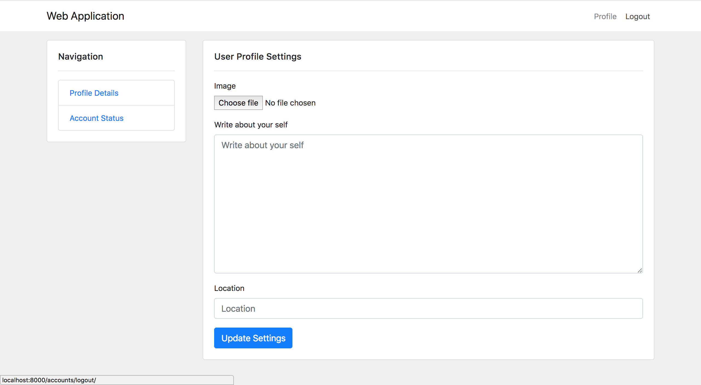

# Django user registration boilerplate with Bootstrap4 

This projects aims to provide a better/common example of Django project with 
bootstrap 4 version of the templates for the user 
registration and authentication views.

We shall be able to use it as plain email based registration alone or along with social auth.

This project uses the following amazing projects from the opensource:

- django-allauth (gives social authentication abilities and covers all the major user registration usecases.)
- django-anymail (gives ability to send emails via any famous email service provider.)
- django-bootstrap4 (gives bootstrap4 UI for the django forms)
- placeholder-pics (generating profile pictures based on name/email)
- django-thumbs-v2 (generating thumbnails of the profile pictures)

The project covers 

- [x] all the user registrations use cases by django-allauth (all the templates uses bootstrap4 UI )
- [x] custom user profile model (one to one relation with User model). 
- [ ]user profile settings pages 
    - [x] update user information, 
    - [ ] de-activate/re-activate user[TODO]
- [x] email backend service(django-anymail) email templates (django-allauth) to work with registration flow 
- [x] generic webpages UI - homepage, terms, about[TODO]

## Screenshots

Homepage
---------

Signin Page
---------

Signup Page
---------

Password reset page
---------

User Profile page
---------

